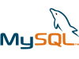

New Way Project
===============

Este é um projeto de Desenvolvimento Web criado para a disciplina Projeto Integrador do SENAC em 2014.

# Objetivo

Desenvolver uma aplicação web que faça pesquisa de veículos e gere um pedido para uma possível compra.

# Ferramentas de desenvolvimento

|  |  |  |   |
|------------------------------|------------------------------|------------------------------|-----------------------------|
| [Python][2] [(en)][3] | [Django][0]                  | [SQLite3][5]                 | [MySQL][6]                  |

# Convenções

**Título de entidades**: primeira maiúscula e no singular. Ex: *Veiculo, Pedido, Usuario, Vendedor*.

**Classes**: em nomes compostos maiúscula e juntas. Ex: *ListarVeiculo, AdicionarVeiculo* ([PEP 8][4]).

**Funções**: nomes compostos minúsculos e separados com underline. Ex: *listar_veiculo, adicionar_veiculo* ([PEP 8][4]).

**Templates**: usar a mesma convenção. Ex: *veiculo_lista.html, veiculo_form.html*.

### Referências:

[Django Project][0]

[Django Brasil][1]

[0]: https://www.djangoproject.com/
[1]: http://www.djangobrasil.org/
[2]: http://www.python.org.br/wiki
[3]: https://www.python.org/
[4]: http://www.python.org.br/wiki/GuiaDeEstilo
[5]: http://www.sqlite.org/
[6]: http://www.mysql.com/