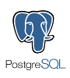

New Way Project
===============

Este é um projeto de Desenvolvimento Web criado para fins acadêmicos.

# Objetivo

Desenvolver uma aplicação web que faça pesquisa de veículos e gere um pedido para uma possível compra.

# Ferramentas de desenvolvimento

|  |  |  |   |
|------------------------------|------------------------------|------------------------------|-----------------------------|
| [Python][2] [(en)][3] 	   | [Django][0]                  | [SQLite3][5]                 | [PostgreSQL][7]                  |

# Convenções

**Título de entidades**: primeira maiúscula e no singular. Ex: *Veiculo, Pedido, Usuario, Vendedor*.

**Classes**: em nomes compostos maiúscula e juntas. Ex: *ListarVeiculo, AdicionarVeiculo* ([PEP 8][4]).

**Funções**: nomes compostos minúsculos e separados com underline. Ex: *listar_veiculo, adicionar_veiculo* ([PEP 8][4]).

**Templates**: usar a mesma convenção. Ex: *veiculo_lista.html, veiculo_form.html*.

# Como instalar

É recomendável usar o virtualenv e ativar o ambiente

	$ virtualenv new_way_project
	$ cd new_way_project
	$ source bin/activate

Clone o repositório

	$ git clone https://github.com/rg3915/new_way_project.git

Instale as libs necessárias (repare na linha a seguir que o virtualenv está ativado).

	(new_way_project)$ pip install -r requirements.txt

Crie o banco de dados

	$ python manage.py syncdb

Rode o server

	$ python manage.py runserver

Abra um navegador e acesse http://127.0.0.1:8000/

# Rode os testes

	$ python manage.py test new_way.subscriptions

## Referências:

[Django Project][0]

[Django Brasil][1]

[0]: https://www.djangoproject.com/
[1]: http://www.djangobrasil.org/
[2]: http://www.python.org.br/wiki
[3]: https://www.python.org/
[4]: http://www.python.org.br/wiki/GuiaDeEstilo
[5]: http://www.sqlite.org/
[6]: http://www.mysql.com/
[7]: http://www.postgresql.org/